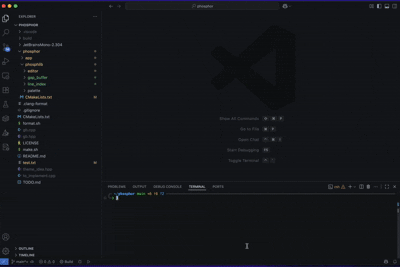

# phosphor
---

As of right now, this is simply a toy project and is mainly to help me learn C++.

The text editor is completely functional, believe it or not, or at least somewhat.
File contents are loaded properly, and empty/non-existent files are handled properly
as well.

Here is a little demo demonstrating what the editor currently looks like and what
it can accomplish.



I am hoping to continue working on this passively as I get better with C++, if you
have any suggestions/comments that would be great!

## Building
---

To build the project, there is a `cmake` solution available. I tried my best to make
a sturdy file with a package manager based build and a `FETCH CONTENT` fall back.

That said, it is C++ so stuff can fail and likely will fail. Luckily Chat Gippity 
exists so hopefully you can get a solution figured out.

```shell
# Raylib uses 3.5 for some god forsaken reason so you need to pass in this flag
# or else you will get yelled at
cmake -B build -S . -DCMAKE_POLICY_VERSION_MINIMUM=3.5
cmake --build build

# Or with a package manager (preferred method)
# This is just the path to my package manager, use whichever one you prefer
VCPKG_ROOT="${VCPKG_ROOT:-$HOME/dev/tools/vcpkg}"
export VCPKG_ROOT

cmake -B build \
    -S . \
    # replace with your manager of choice
    -DCMAKE_TOOLCHAIN_FILE=$VCPKG_ROOT/scripts/buildsystems/vcpkg.cmake

cmake --build build
```

## Acknowledgments
---

Fonts retrieved from [Fonts](https://www.jetbrains.com/lp/mono/)
Please see `OFL.txt` for information on the JetBrains' font licensing.